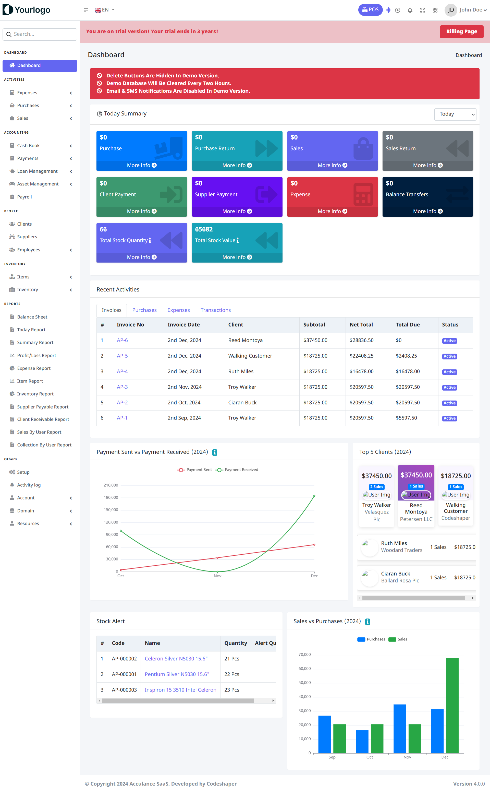
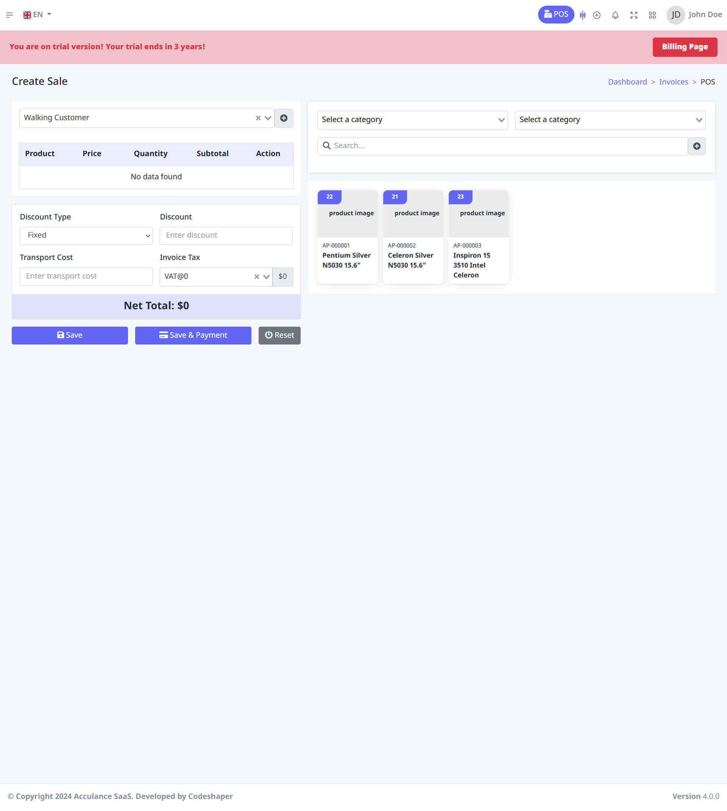
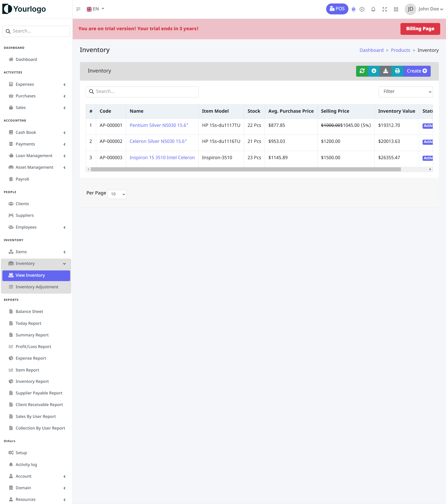

# Acculance SaaS 🌟  
**Acculance SaaS** is a cutting-edge, feature-rich application designed to streamline Point-of-Sale (POS), inventory management, and accounting processes for businesses of all sizes. Built with scalability and multi-tenancy in mind, this SaaS solution helps businesses optimize operations, reduce costs, and improve efficiency.

---

## 🛒 Pricing  

| **License Type**        | **Price**     | **Features**                                                                                 |  
|--------------------------|---------------|---------------------------------------------------------------------------------------------|  
| **Regular License**      | $148           | - Use for a single project. <br> - End users cannot be charged for using the product.       |  
| **Extended License**     | $280          | - Use for multiple projects or a SaaS platform. <br> - End users can be charged for access. |  


---

## 🖼️ Demo Screenshots  
### Dashboard  
  
*A powerful, intuitive dashboard for quick insights into your business performance.*

### POS Interface  
  
*A seamless and user-friendly POS system tailored for retail and hospitality businesses.*

### Inventory Management  
  
*Easily track stock levels, receive alerts, and make adjustments.*

### Accounting Module  
  
*Simplify financial tracking with integrated ledgers and reporting tools.*

---

## 🛠️ Features  

### **Core Functionalities**  
- **Point-of-Sale (POS):**  
  - Easy-to-use POS system for retail and hospitality businesses.  
  - Support for product variations, discounts, and tax configurations.  
  - Real-time invoice generation and printing.  

- **Inventory Management:**  
  - Track stock levels across multiple locations.  
  - Low stock alerts and stock adjustment functionalities.  
  - Barcode support for quick item lookups.  

- **Accounting:**  
  - Generate and manage financial reports, invoices, and payments.  
  - Support for income/expense tracking and tax compliance.  
  - Integrated ledger and bank reconciliation.  

### **SaaS Features**  
- Multi-Tenancy Support: Serve multiple clients with isolated data.  
- Subscription Management: Built-in subscription plans and billing management.  
- Custom Branding: White-label solution with customization options.  

### **Advanced Reporting and Analytics**  
- Sales, inventory, and financial analytics to drive data-driven decisions.  
- Visual dashboards for key performance metrics.  

---

## 🏗️ Tech Stack  
- **Frontend:** React.js, Vue.js, or Angular.js (depending on the specific implementation).  
- **Backend:** Laravel (PHP Framework).  
- **Database:** MySQL/PostgreSQL.  
- **Authentication:** OAuth2/JWT.  
- **Hosting:** Compatible with AWS, DigitalOcean, or self-hosting options.  

---

## 🚀 Getting Started  

### **Prerequisites**  
Ensure the following tools are installed on your system:  
- PHP 8.x  
- Composer  
- Node.js (for frontend dependencies)  
- MySQL/PostgreSQL  

### **Installation**  
1. Clone the repository:  
   ```bash  
   git clone https://github.com/yourusername/acculance-saas.git  
   ```  

2. Navigate to the project directory:  
   ```bash  
   cd acculance-saas  
   ```  

3. Install PHP dependencies:  
   ```bash  
   composer install  
   ```  

4. Install Node.js dependencies:  
   ```bash  
   npm install  
   ```  

5. Configure the `.env` file with your database and SMTP settings:  
   ```bash  
   cp .env.example .env  
   nano .env  
   ```  

6. Run database migrations and seeders:  
   ```bash  
   php artisan migrate --seed  
   ```  

7. Start the development server:  
   ```bash  
   php artisan serve  
   ```  

8. Access the application in your browser:  
   ```  
   http://localhost:8000  
   ```  

---

## 📖 Documentation  
Detailed documentation is available in the [Docs](./docs) directory or on the [official website](#).  

---

## 🤝 Contributing  
We welcome contributions! Please follow these steps:  
1. Fork the repository.  
2. Create a new branch:  
   ```bash  
   git checkout -b feature-name  
   ```  
3. Commit your changes:  
   ```bash  
   git commit -m "Add a new feature"  
   ```  
4. Push to the branch:  
   ```bash  
   git push origin feature-name  
   ```  
5. Submit a pull request.  

---

## 🛡️ License  
This project is licensed under the [MIT License](./LICENSE).  

---

## 📞 Support  
For support or questions, feel free to reach out:  
- **Email:** khansaab7828@gmail.com  

---
